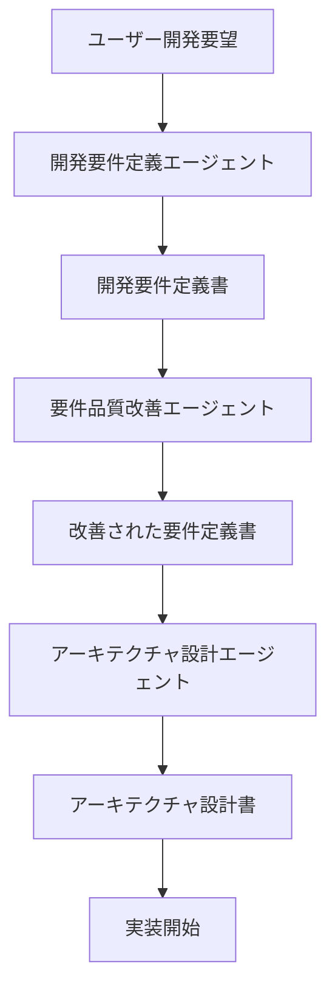
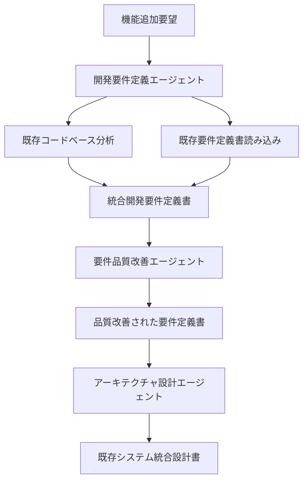
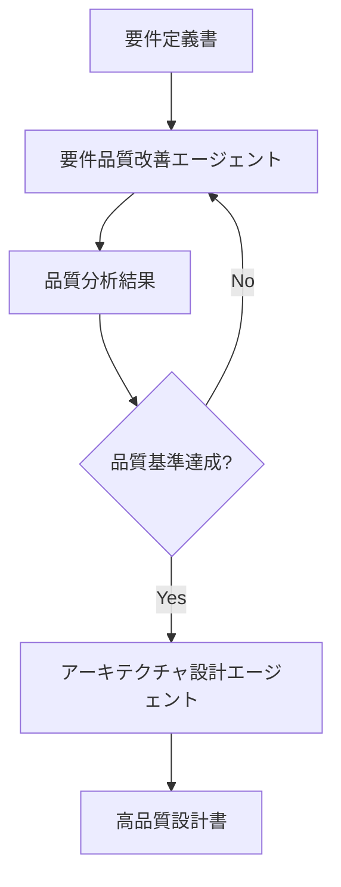

# Mastraエージェント責務分離設計

## 📋 概要

このドキュメントでは、明確に責務を分離したMastraエージェントの役割、機能、使用方法をまとめています。

## 🎯 責務分離の原則

### 設計思想
- **単一責任の原則**: 各エージェントは1つの専門領域に特化
- **明確な境界**: エージェント間の責務が重複しない
- **連携の最適化**: エージェント間の効率的な情報受け渡し

### 開発フロー
```
ユーザー要望 → 開発要件定義 → 品質改善 → アーキテクチャ設計 → 実装
```

## 🤖 エージェント一覧

### 1. 開発要件定義エージェント (`requirement-agent.ts`)

#### 🎯 専門領域（責務）
- ✅ ユーザーの開発要望を技術的観点から分析
- ✅ 開発要件の明確化と構造化
- ✅ 技術仕様と実装方針の定義
- ✅ 開発工数とリスクの評価

#### ❌ 対象外（他エージェントの責務）
- ❌ ビジネス価値の評価
- ❌ 市場分析や競合調査
- ❌ 詳細なアーキテクチャ設計
- ❌ UI/UXデザイン

#### 🔧 技術仕様
```typescript
type RequirementAgentContext = {
  projectType?: string;        // 'web-app', 'mobile-app', 'api', 'desktop-app'
  techStack?: string;          // 'react', 'vue', 'node', 'python'
  complexity?: 'simple' | 'medium' | 'complex';
  timeframe?: string;          // '1ヶ月', '3ヶ月', '6ヶ月'
  budget?: 'low' | 'medium' | 'high';
  existingProject?: boolean;   // 既存プロジェクトの拡張かどうか
}
```

#### 🛠️ 利用ツール
- `codebaseAnalysisTool`: 既存コードベースの分析
- `requirementsReaderTool`: 既存要件定義書の読み込み

#### 📝 出力形式
```markdown
# 開発要件定義書

## 開発概要
- 開発目的、対象システム、技術的価値、完了基準

## 機能要件（技術観点）
- 実装機能一覧、API仕様、データ構造、処理フロー

## 技術仕様
- 推奨技術スタック、アーキテクチャ方針、データベース設計

## 非機能要件（技術観点）
- パフォーマンス、スケーラビリティ、セキュリティ、保守性

## 開発制約
- 技術制約、環境制約、互換性制約、リソース制約

## 実装計画
- 開発フェーズ、マイルストーン、依存関係、リスク要因

## テスト要件
- テスト戦略、テストケース、品質基準、自動化方針

## 運用・保守要件
- 監視要件、デプロイ要件、バックアップ要件
```

---

### 2. 要件品質改善エージェント (`refine-agent.ts`)

#### 🎯 専門領域（責務）
- ✅ 既存要件定義書の品質分析
- ✅ 要件の明確性・完全性・テスト可能性の向上
- ✅ SMART基準に基づく要件の改善
- ✅ 受け入れ基準の具体化

#### ❌ 対象外（他エージェントの責務）
- ❌ 新規要件の作成
- ❌ 技術的実装方法の提案
- ❌ ビジネス価値の評価
- ❌ アーキテクチャ設計

#### 🔧 技術仕様
```typescript
type RefineAgentContext = {
  requirementsPath?: string;   // 要件定義書のファイルパス
  focusArea?: string;          // 重点改善領域
  qualityLevel?: 'basic' | 'standard' | 'high';
  improvementType?: 'clarity' | 'completeness' | 'testability' | 'all';
}
```

#### 🛠️ 利用ツール
- `requirementsReaderTool`: 既存要件定義書の読み込み

#### 📝 品質チェック項目
- **SMART基準**: Specific, Measurable, Achievable, Relevant, Time-bound
- **受け入れ基準**: Given-When-Then形式、具体的な入出力定義
- **明確性**: 曖昧な表現の具体化
- **完全性**: 不足情報の特定・補完
- **テスト可能性**: 検証可能な形への修正

#### 📝 出力形式
```markdown
# 改善された要件定義書

## 品質改善サマリー
- 改善項目数、主要改善点、品質スコア

## [元の構造を維持しつつ改善された内容]

## 改善詳細
### 明確性の改善
### 完全性の改善
### テスト可能性の改善

## 残課題・推奨事項
```

---

### 3. アーキテクチャ設計エージェント (`generate-design-agent.ts`)

#### 🎯 専門領域（責務）
- ✅ 要件定義書からアーキテクチャ設計への変換
- ✅ システム全体の技術設計とコンポーネント設計
- ✅ 既存システムとの統合設計
- ✅ 技術的実装方針の策定

#### ❌ 対象外（他エージェントの責務）
- ❌ 要件定義の作成・修正
- ❌ ビジネス価値の評価
- ❌ 詳細なコード実装
- ❌ プロジェクト管理

#### 🔧 技術仕様
```typescript
type GenerateDesignAgentContext = {
  requirementsPath?: string;   // 要件定義書のパス
  projectPath?: string;        // プロジェクトルートパス
  designLevel?: 'high-level' | 'detailed' | 'implementation-ready';
  architectureStyle?: 'monolithic' | 'microservices' | 'serverless' | 'hybrid';
  includeTests?: boolean;      // テスト設計を含むか
}
```

#### 🛠️ 利用ツール
- `requirementsReaderTool`: 要件定義書の読み込み
- `codebaseAnalysisTool`: 既存コードベースの分析

#### 📝 設計方針
- **スケーラビリティ**: 将来の拡張性を考慮
- **保守性**: 理解しやすく変更しやすい設計
- **テスト可能性**: テストしやすいアーキテクチャ
- **パフォーマンス**: 性能要件を満たす設計

#### 📝 出力形式
```markdown
# アーキテクチャ設計書

## 設計概要
- アーキテクチャスタイル、技術スタック、設計原則

## システムアーキテクチャ
- 全体構成図、レイヤー構成、コンポーネント図

## コンポーネント設計
- 各コンポーネントの責務、インターフェース、依存関係

## データアーキテクチャ
- データモデル、データフロー、永続化戦略

## API設計
- API仕様、認証・認可、バージョニング

## 非機能設計
- パフォーマンス、セキュリティ、可用性、監視

## 技術選定
- フレームワーク、ライブラリ、インフラ、ツール選定

## 実装ガイドライン
- コーディング規約、設計パターン、テスト戦略

## 移行・統合戦略
- 既存システム分析、移行計画、データ移行

## 運用・保守設計
- 監視設計、デプロイ設計、バックアップ設計
```

---

## 🔄 責務分離による連携フロー

### 基本的な開発フロー


### 既存プロジェクト拡張フロー


### 品質重視フロー


## 🚀 API使用方法

### エンドポイント
```
POST /api/agents/{agentName}/generate
```

### 利用可能なエージェント名
- `requirementAgent`: 開発要件定義エージェント
- `refineAgent`: 要件品質改善エージェント
- `generateDesignAgent`: アーキテクチャ設計エージェント

### 使用例1: 新規開発要件定義
```json
{
  "message": "ECサイトに商品レビュー機能を追加したい",
  "runtimeContext": {
    "projectType": "web-app",
    "techStack": "react-node",
    "complexity": "medium",
    "existingProject": true
  }
}
```

### 使用例2: 要件品質改善
```json
{
  "message": "この要件定義書の品質を改善してください",
  "runtimeContext": {
    "requirementsPath": "./REQUIREMENT/current.md",
    "qualityLevel": "high",
    "improvementType": "all"
  }
}
```

### 使用例3: アーキテクチャ設計
```json
{
  "message": "要件定義書からアーキテクチャ設計書を生成してください",
  "runtimeContext": {
    "requirementsPath": "./REQUIREMENT/improved.md",
    "projectPath": "./",
    "designLevel": "detailed",
    "architectureStyle": "microservices"
  }
}
```

## 📊 責務分離のメリット

### 🎯 明確性
- 各エージェントの役割が明確
- 使用場面の判断が容易
- 期待する出力が予測可能

### 🔧 保守性
- エージェント単体での改善が可能
- 責務の変更が他に影響しない
- テストとデバッグが容易

### ⚡ 効率性
- 専門特化による高品質な出力
- 不要な処理の排除
- 最適なツール選択

### 🔄 拡張性
- 新しい専門エージェントの追加が容易
- 既存エージェントへの影響なし
- 段階的な機能拡張が可能

---

## 📞 サポート

質問や改善提案がある場合は、プロジェクトのIssueまたはDiscussionでお知らせください。

**最終更新**: 2024年12月  
**バージョン**: 2.0.0（責務分離版） 