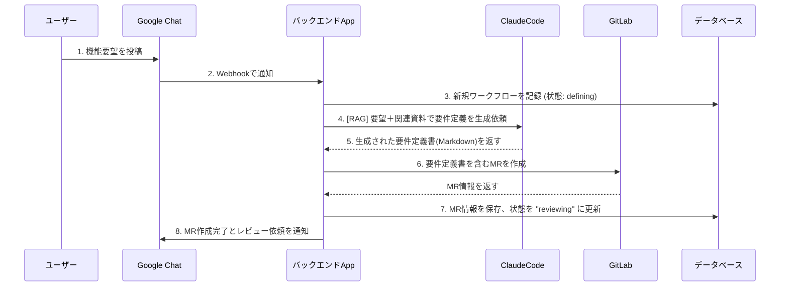

# 第一フェーズ実装計画書

## 📋 概要

第一フェーズでは、Google Chatでの機能要望投稿から要件定義書生成、GitLab MR作成までの自動化フローを実装します。

## 🎯 実装対象フロー



## 📝 タスク分割と対応順序

### Phase 1.1: 基盤インフラの構築

#### タスク 1.1.1: プロジェクト初期設定とデータベース設計
**優先度**: 高  
**所要時間**: 2-3時間  
**依存関係**: なし

**実装内容**:
- Mastraプロジェクトの初期設定
- データベーススキーマ設計
- ワークフローテーブルの実装

**詳細要件**:
```typescript
// ワークフローテーブルスキーマ
interface WorkflowRecord {
  id: string;
  status: 'defining' | 'reviewing' | 'approved' | 'rejected' | 'implementing';
  originalRequest: string; // Google Chatの原文
  chatThreadId: string;    // Google Chat スレッドID
  userId: string;          // 要求者ID
  generatedRequirement?: string; // 生成された要件定義
  gitlabMrUrl?: string;   // GitLab MR URL
  gitlabMrId?: string;    // GitLab MR ID
  createdAt: Date;
  updatedAt: Date;
  metadata?: Record<string, any>;
}
```

**成果物**:
- [ ] データベースマイグレーションファイル
- [ ] 基本的なWorkflowRepositoryクラス  
- [ ] CRUD操作の単体テスト

**テスト戦略**:
- データベース接続テスト
- CRUD操作の単体テスト
- スキーマ検証テスト

**エビデンス**:
- テスト実行結果のスクリーンショット
- データベーステーブル作成確認

---

#### タスク 1.1.2: Google Chat Webhook エンドポイント実装
**優先度**: 高  
**所要時間**: 3-4時間  
**依存関係**: タスク 1.1.1

**実装内容**:
- Google Chat Webhook 受信エンドポイント
- メッセージパーシング機能
- 基本的なバリデーション

**詳細要件**:
```typescript
// Google Chatメッセージの型定義
interface GoogleChatMessage {
  type: 'MESSAGE';
  eventTime: string;
  message: {
    name: string;
    sender: {
      name: string;
      displayName: string;
      email: string;
    };
    text: string;
    thread: {
      name: string;
    };
    space: {
      name: string;
    };
  };
}

// Webhook エンドポイント
POST /api/webhook/google-chat
```

**成果物**:
- [ ] Google Chat Webhook エンドポイント
- [ ] メッセージパーサー  
- [ ] Webhook受信の統合テスト

**テスト戦略**:
- 模擬メッセージでのWebhook受信テスト
- 不正なペイロードに対するエラーハンドリングテスト
- メッセージパーシングの単体テスト

**エビデンス**:
- curlコマンドでのWebhook テスト結果
- ログ出力の確認

---

### Phase 1.2: AI要件定義生成機能

#### タスク 1.2.1: Claude API連携とRAG基盤実装
**優先度**: 高  
**所要時間**: 4-5時間  
**依存関係**: タスク 1.1.1

**実装内容**:
- Claude API連携クライアント
- 要件定義生成プロンプトテンプレート
- RAG用ドキュメント管理基盤

**詳細要件**:
```typescript
// 要件定義生成エージェント
const requirementAgent = new Agent({
  name: "RequirementDefinitionAgent",
  description: "機能要望から要件定義書を生成",
  instructions: `
    ユーザーの機能要望を分析し、以下の構造で要件定義書を生成してください：
    
    ## 機能概要
    ## 機能要件
    ## 非機能要件  
    ## 制約事項
    ## 受け入れ条件
  `,
  model: claude35sonnet,
  tools: [ragSearchTool, templateGeneratorTool]
});
```

**成果物**:
- [ ] Claude API連携クライアント
- [ ] 要件定義生成エージェント
- [ ] プロンプトテンプレート
- [ ] 生成結果の単体テスト

**テスト戦略**:
- サンプル要望での要件定義生成テスト
- プロンプト品質の確認テスト
- API呼び出しのモックテスト

**エビデンス**:
- 実際の要件定義生成結果サンプル
- 生成時間とコストの記録

---

#### タスク 1.2.2: RAGシステムの実装
**優先度**: 中  
**所要時間**: 3-4時間  
**依存関係**: タスク 1.2.1

**実装内容**:
- 関連ドキュメント検索機能
- ベクトル検索とコンテキスト生成
- RAG品質向上機能

**詳細要件**:
```typescript
// RAG検索ツール
const ragSearchTool = createTool({
  id: "rag-search",
  description: "関連ドキュメントを検索してコンテキストを生成",
  inputSchema: z.object({
    query: z.string(),
    maxResults: z.number().default(5)
  }),
  execute: async ({ context }) => {
    // ベクトル検索とコンテキスト生成
  }
});
```

**成果物**:
- [ ] RAG検索ツール
- [ ] ドキュメントインデックス機能
- [ ] 検索品質の評価テスト

**テスト戦略**:
- 検索精度のテスト
- レスポンス時間の測定
- 関連性スコアの検証

**エビデンス**:
- 検索結果の精度レポート
- 処理時間の測定結果

---

### Phase 1.3: GitLab連携機能

#### タスク 1.3.1: GitLab API連携実装
**優先度**: 高  
**所要時間**: 3-4時間  
**依存関係**: なし

**実装内容**:
- GitLab API クライアント
- MR作成機能
- エラーハンドリング

**詳細要件**:
```typescript
// GitLab MR作成ツール
const createMRTool = createTool({
  id: "create-gitlab-mr",
  description: "要件定義書でMRを作成",
  inputSchema: z.object({
    title: z.string(),
    content: z.string(),
    sourceBranch: z.string(),
    targetBranch: z.string().default("main")
  }),
  execute: async ({ context }) => {
    // GitLab MR作成ロジック
  }
});
```

**成果物**:
- [ ] GitLab APIクライアント
- [ ] MR作成ツール
- [ ] API呼び出しの統合テスト

**テスト戦略**:
- テスト用リポジトリでのMR作成テスト
- API認証のテスト
- エラーレスポンスの処理テスト

**エビデンス**:
- 実際に作成されたテストMRのURL
- API呼び出しログ

---

#### タスク 1.3.2: MR作成ワークフロー統合
**優先度**: 高  
**所要時間**: 2-3時間  
**依存関係**: タスク 1.3.1, 1.2.1

**実装内容**:
- 要件定義からMR作成までの自動化
- ブランチ管理機能
- MR情報の保存

**詳細要件**:
```typescript
// MR作成ワークフロー
const createRequirementMRWorkflow = createWorkflow({
  id: "create-requirement-mr",
  inputSchema: z.object({
    workflowId: z.string(),
    requirement: z.string()
  }),
  steps: [
    createBranchStep,
    createRequirementFileStep, 
    createMRStep,
    saveMRInfoStep
  ]
});
```

**成果物**:
- [ ] MR作成ワークフロー
- [ ] ブランチ管理機能
- [ ] ワークフロー統合テスト

**テスト戦略**:
- End-to-EndでのMR作成テスト
- ブランチ衝突の処理テスト
- ワークフロー失敗時のロールバックテスト

**エビデンス**:
- 完全な自動MR作成のデモ動画
- エラーケースの処理確認

---

### Phase 1.4: システム統合とGoogle Chat通知

#### タスク 1.4.1: 全体ワークフロー統合
**優先度**: 最高  
**所要時間**: 4-5時間  
**依存関係**: 全ての前タスク

**実装内容**:
- メインワークフローの実装
- エラーハンドリングの統合
- ログ機能の実装

**詳細要件**:
```typescript
// メインワークフロー
const mainRequirementWorkflow = createWorkflow({
  id: "main-requirement-generation",
  inputSchema: GoogleChatMessageSchema,
  steps: [
    parseMessageStep,
    createWorkflowRecordStep,
    generateRequirementStep,
    createMRStep,
    updateWorkflowRecordStep,
    sendNotificationStep
  ]
});
```

**成果物**:
- [ ] メインワークフロー
- [ ] 統合エラーハンドリング
- [ ] 包括的ログ機能
- [ ] End-to-Endテスト

**テスト戦略**:
- 完全フローのEnd-to-Endテスト
- エラーケースでの処理確認
- パフォーマンステスト

**エビデンス**:
- 完全フローの実行ログ
- パフォーマンス測定結果

---

#### タスク 1.4.2: Google Chat通知機能実装
**優先度**: 高  
**所要時間**: 2-3時間  
**依存関係**: タスク 1.4.1

**実装内容**:
- Google Chat API での返信機能
- 通知メッセージテンプレート
- スレッド管理

**詳細要件**:
```typescript
// Google Chat通知ツール
const sendChatNotificationTool = createTool({
  id: "send-chat-notification",
  description: "Google Chatに通知を送信",
  inputSchema: z.object({
    threadId: z.string(),
    message: z.string(),
    messageType: z.enum(["success", "error", "info"])
  })
});
```

**成果物**:
- [ ] Google Chat通知ツール
- [ ] メッセージテンプレート
- [ ] 通知の統合テスト

**テスト戦略**:
- 各タイプの通知送信テスト
- スレッド管理の確認
- メッセージ形式の検証

**エビデンス**:
- 実際のGoogle Chat通知のスクリーンショット
- 各種通知パターンの確認

---

## ✅ 完了基準

### 各タスクの完了基準
1. **実装完了**: すべてのコード実装とテストがパス
2. **エビデンス確保**: 動作確認のスクリーンショット・ログ取得
3. **ドキュメント更新**: 実装内容のドキュメント化
4. **品質チェック**: TSDoc、型安全性、エラーハンドリングの確認

### フェーズ全体の完了基準
- [ ] すべてのタスクが完了済み
- [ ] End-to-Endテストが全てパス
- [ ] パフォーマンス要件を満たしている
- [ ] エラーハンドリングが適切に動作
- [ ] ドキュメントが最新状態
- [ ] 本番デプロイ準備完了

## 📊 進捗管理

### タスク進捗トラッキング
- **未着手**: ⭕
- **進行中**: 🟡
- **テスト中**: 🔵  
- **完了**: ✅
- **問題発生**: ❌

### 週次進捗レビュー
- 完了タスクの品質確認
- 未完了タスクの問題分析
- スケジュール調整の必要性検討
- 次週の優先順位設定

## 🚨 リスク管理

### 技術リスク
- **Google Chat API制限**: レート制限対策実装
- **Claude API コスト**: 使用量モニタリング
- **GitLab API認証**: トークン管理の自動化
- **データベース接続**: 接続プール最適化

### スケジュールリスク  
- **API連携遅延**: 各APIの事前検証実施
- **統合テスト複雑化**: 段階的統合によるリスク分散
- **要件変更**: 柔軟な設計アーキテクチャ採用

---

## 📚 関連ドキュメント

- [Mastra開発要件定義ガイド](.cursor/rules/mastra-requirements-guide.mdc)
- [実装進行管理ルール](.cursor/rules/phase1-development-rules.mdc)
- [品質保証チェックリスト](docs/quality-checklist.md) 